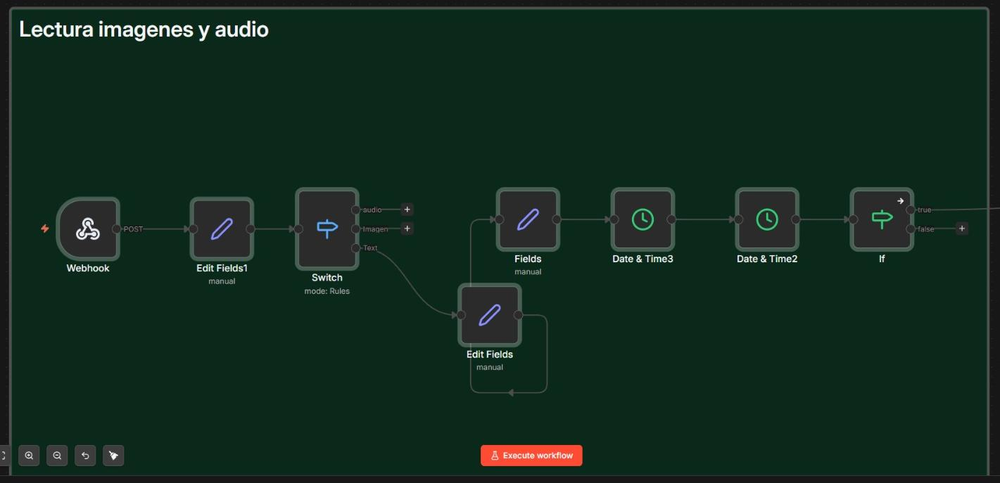
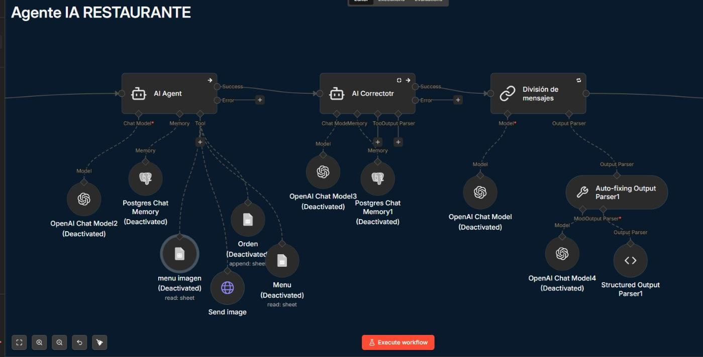
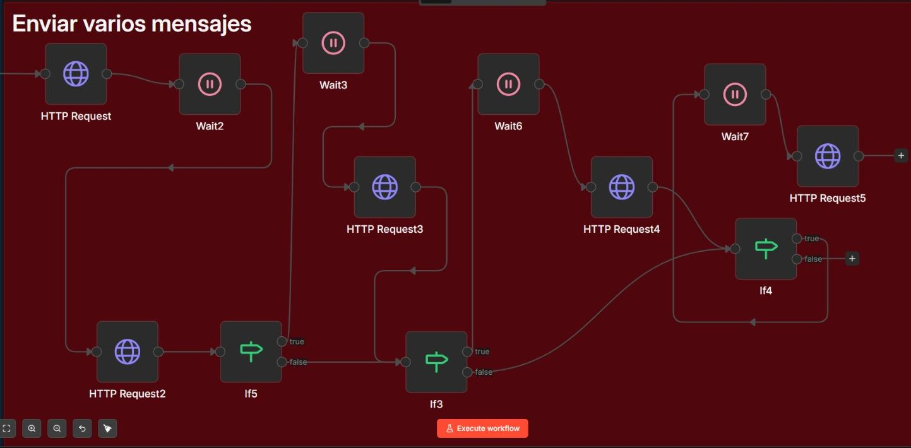
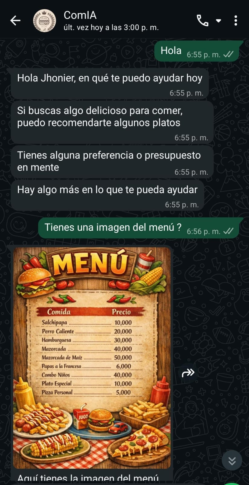
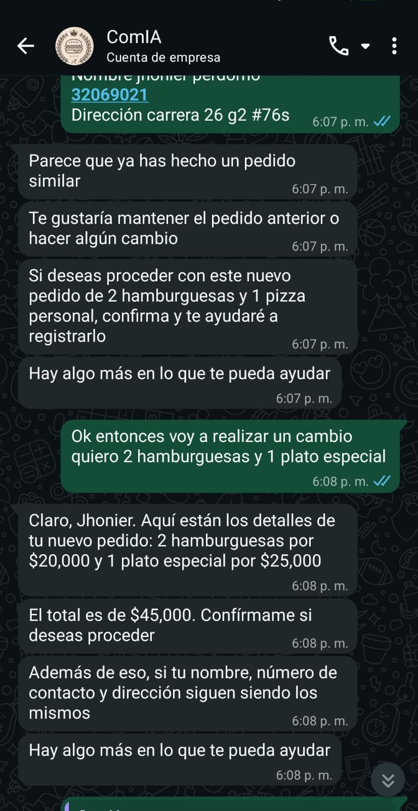
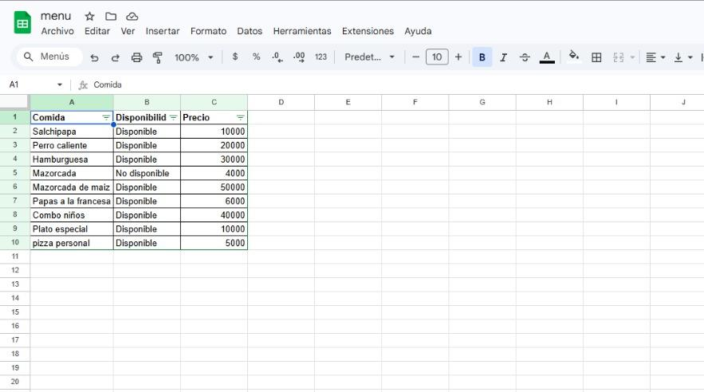
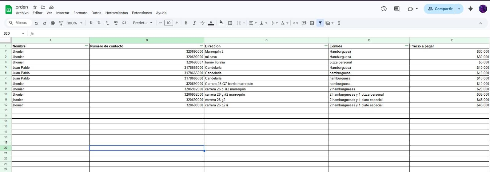

# **Sistema de automatización para restaurantes con IA por WhatsApp**

Sistema de automatización para atención de clientes vía WhatsApp utilizando inteligencia artificial.  
Fue diseñado para resolver una problemática común en restaurantes y negocios similares: la demora en responder mensajes, la pérdida de clientes por falta de atención oportuna y la carga operativa de estar contestando manualmente cada conversación.

Este proyecto permite gestionar pedidos, responder consultas y simular una interacción conversacional natural, reduciendo tiempos de respuesta y apoyando el trabajo del personal.

---

## ¿Por qué lo desarrollé?

Este proyecto fue creado pensando en una necesidad real de negocio.

Muchos restaurantes reciben mensajes por WhatsApp, pero no siempre pueden responder a tiempo.  
Eso genera pérdida de clientes, retrasos en los pedidos y sobrecarga para los trabajadores, que terminan dedicando tiempo a contestar mensajes en lugar de atender otras tareas.

Por eso desarrollé este sistema: para automatizar la atención inicial, facilitar la gestión de pedidos y permitir que el personal revise la información desde una base de datos sin tener que escribir manualmente cada respuesta.

También lo desarrollé como parte de mi crecimiento personal y técnico, aplicando automatización, integración de APIs y construcción de flujos conversacionales con inteligencia artificial.

---

## Funcionalidades

- Atención automatizada mediante IA
- Envío de menú con imágenes
- Toma de pedidos en tiempo real
- Confirmación de pedidos con datos del cliente
- Memoria de conversación
- Respuestas divididas para simular comportamiento humano
- Flujo conversacional natural, sin repetición de mensajes
- Envío dinámico de imágenes mediante enlaces almacenados en base de datos

---

## Tecnologías utilizadas

- **n8n** para automatización de flujos
- **API de OpenAI** para procesamiento con IA
- **Evolution API** para integración con WhatsApp
- **PostgreSQL** para almacenamiento de datos y memoria
- **Google Sheets API** para gestión de información en hojas de cálculo
- **VPS** para despliegue en producción

---

## Funcionamiento del sistema

1. El usuario envía un mensaje por WhatsApp
2. El sistema procesa la entrada
3. La IA genera una respuesta contextual
4. Se consulta la memoria de conversaciones previas
5. Se accede al menú almacenado en base de datos
6. Se envían imágenes dinámicamente mediante enlaces
7. Se genera y confirma el pedido
8. La respuesta se divide en varios mensajes para simular una conversación más humana

---

## Capturas del sistema

### Flujo del sistema

### Procesamiento


### Agente IA


### Envío de mensajes


### Interacción con el usuario

### Inicio


### Pedido


### Memoria


### Flujo natural


### Menú y gestión de pedidos

### Menú


### Gestión de pedidos

---

## Manejo de datos

El sistema utiliza múltiples estructuras de datos:

- **Pedidos**: almacenamiento de información del cliente y órdenes realizadas
- **Menú**: productos disponibles, precios y metadatos
- **Imágenes**: enlaces almacenados en base de datos que permiten el envío dinámico de contenido visual

Todos los datos incluidos en este repositorio son de prueba y no corresponden a información real.

---

## Experimentos

Durante el desarrollo se exploró el uso de Redis para optimizar el procesamiento de mensajes mediante agrupación en ventanas de tiempo.

Esta implementación no forma parte del flujo principal, pero se incluye como prueba técnica:

- [Ver implementación con Redis](experiments/redis-message-buffer.json)

---

## Estructura del proyecto

```bash
ai-whatsapp-restaurant-agent/
│
├── restaurant-ai-workflow.json   # Flujo principal de automatización
├── screenshots/                  # Capturas del sistema
├── experiments/                  # Pruebas y desarrollos alternativos (Redis)
├── README.md                     # Documentación del proyecto
